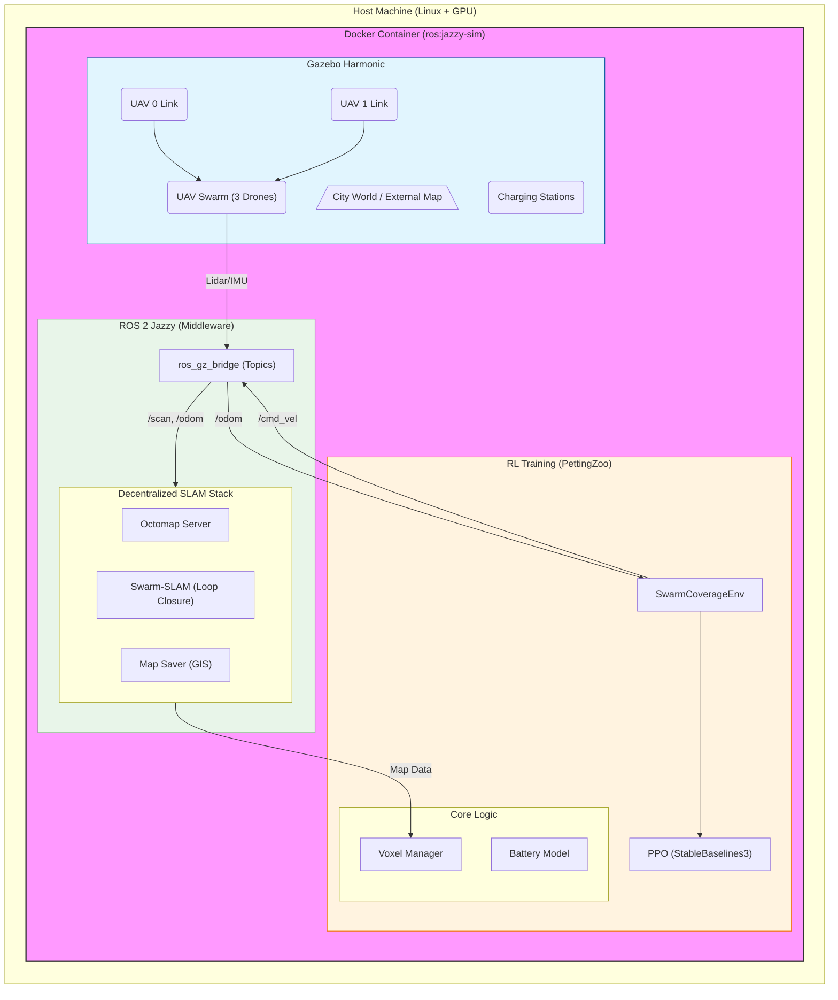

## System Architecture



## 1. Project Anatomy (New Structure)
The `src/` directory is now organized for clarity:

```
src/
├── swarm_sim_pkg/         # [YOUR CODE] Main package (Env, Assets, Launch)
│   ├── launch/            # Launch files (multi_ops.launch.py, swarm_slam.launch.py)
│   ├── swarm_sim/         # Python Source
│   │   ├── envs/          # PettingZoo Environments
│   │   ├── training/      # RL Training Scripts (train_mappo.py)
│   │   └── evaluation/    # Inference Scripts (evaluate_swarm.py)
│   └── package.xml        # ROS 2 Manifest
│
├── swarm_slam_stack/      # [SLAM LOGIC] The Real Decentralized SLAM (Swarm-SLAM)
│   ├── cslam/             # Core Logic
│   └── cslam_experiments/ # Launch Configs
│
└── external_libs/         # [DEPENDENCIES] Third-party libraries built from source
    ├── eigen/             # Linear Algebra
    ├── gtsam/             # Factor Graphs
    └── TEASER-plusplus/   # 3D Registration
```

```

## 2. All-in-One Docker Setup (Recommended)
This method builds dependencies (GTSAM, TEASER, RLLib) and compiles the workspace inside the image.

1.  **Build the Image** (First time):
    ```bash
    docker-compose build
    ```
    *This takes time as it compiles libraries and your code.*

2.  **Start the Environment**:
    ```bash
    docker-compose up
    ```

3.  **Access (Choose One)**:
    -   **Web Browser**: [http://YOUR_SERVER_IP:6080](http://localhost:6080) (Easy)
    -   **VNC Client**: `YOUR_SERVER_IP:5901` (Fast)

3.  **FAST / NATIVE GPU MODE** (Recommended for Performance):
    If VNC is too slow, use your host's screen directly.
    
    1.  **Preparation**: Run on host:
        ```bash
        xhost +local:root
        ```
    2.  **Edit `docker-compose.yml`**:
        -   Set `GUI=host`
        -   Set `DISPLAY=${DISPLAY}` (or your actual display var, e.g. `:0`)
        -   Uncomment `- ~/.Xauthority:/root/.Xauthority:rw`
    3.  **Run**:
        ```bash
        docker compose up
        # Then exec into container to launch apps
        docker exec -it rosette_swarm bash
        ros2 launch swarm_sim multi_ops.launch.py
        ```

### Remote Server / SSH Access
If you are running this on a remote server (e.g. AWS, Lab Server) via SSH:

1.  **Do NOT use Native Mode**. Stick to `GUI=vnc`.
2.  **Tunnel the Port**: When you SSH in, forward port 6080:
    ```bash
    ssh -L 6080:localhost:6080 user@your-server-ip
    ```
3.  **View Locally**: Open [http://localhost:6080](http://localhost:6080) on your *local laptop*.
If you clone this repo fresh on a new machine...

## 4. Troubleshooting Connections
If you cannot connect to VNC (`YOUR_IP:5090`) but the logs say "success: x11vnc entered RUNNING state":

1.  **FIREWALL (Most Likely)**:
    -   Your server (AWS, GCP, UFW) is blocking port `5090` and `5901`.
    -   **Fix**: Update your Security Group / Firewall to allow TCP traffic on these ports.
    -   *Test*: Run `netstat -tuln | grep 5090` on the server. If it shows "LISTEN", the server is fine. The block is external.

2.  **VNC Client Encryption**:
    -   We use `-nopw` (No Password).
    -   Some clients (RealVNC) reject this by default.
    -   **Fix**: Set your client's Encryption/Security setting to "None" or "Let Server Choose".

1.  **Install System Dependencies** (Sudo Required):
    ```bash
    bash setup_real_slam.sh
    ```
    *This script installs Boost, PCL, and compiles GTSAM/TEASER so you don't have to.*

2.  **Build the Workspace**:
    ```bash
    source /opt/ros/jazzy/setup.bash
    colcon build --symlink-install
    source install/setup.bash
    ```

## 3. Workflow Cheatsheet
> **IMPORTANT**: Run these commands **inside** the Docker container.
> 1. `docker exec -it rosette_swarm bash`
> 2. `source install/setup.bash`

### A. Launch Simulation (Visuals)
**Default City:**
```bash
ros2 launch swarm_sim multi_ops.launch.py num_drones:=3 components:=lidar,imu,battery
```

**Specific Maps (Competition Worlds):**
We have a helper script to load external maps easily.
```bash
# Syntax: ./src/launch_session.sh [MapName] [NumDrones]

# Examples:
./src/launch_session.sh Acourse 3    # Competition Track A
./src/launch_session.sh Bcourse 3    # Competition Track B
./src/launch_session.sh usarmy 3     # Outdoor / Field Environment
./src/launch_session.sh rokarmy 3    # Outdoor / Training Field
./src/launch_session.sh 3m_wall 1    # Simple Obstacle
```
> **View**: Open VNC.

### B. Generate Custom City (Procedural)
You can generate a new random city with specific density and seed.
```bash
# Full density, specific seed
python3 src/swarm_sim_pkg/swarm_sim/assets/worlds/generate_city.py \
    --mode full --seed 42 --output src/swarm_sim_pkg/swarm_sim/assets/worlds/my_city.sdf

# Launch it
ros2 launch swarm_sim multi_ops.launch.py map_type:=world map_file:=src/swarm_sim_pkg/swarm_sim/assets/worlds/my_city.sdf
```

### C. Launch Real SLAM (Backend)
Start the decentralized mapping logic.
```bash
# In a new terminal
source install/setup.bash
ros2 launch swarm_sim swarm_slam.launch.py num_drones:=3 config_file:=kitti_lidar.yaml
```

### C. Train Agents (MAPPO)
Run Multi-Agent PPO training using RLLib.
```bash
# In a new terminal
export PYTHONPATH=$PYTHONPATH:$(pwd)/src/swarm_sim_pkg
python3 src/swarm_sim_pkg/swarm_sim/training/train_mappo.py
```

### 1. Control the Drones (Teleop)

To move a drone, you need `teleop_twist_keyboard`.

**Install (Once):**
```bash
apt-get update && apt-get install -y ros-jazzy-teleop-twist-keyboard
```

**Run (In a new terminal):**
```bash
# Control Drone 0
source /opt/ros/jazzy/setup.bash
ros2 run teleop_twist_keyboard teleop_twist_keyboard --ros-args -r cmd_vel:=/uav_0/cmd_vel
```
*(Use keys: `i`=forward, `k`=stop, `j`=left, `l`=right)*

### 2. Visualization (RViz2)

If RViz seems "empty", it's because you need to select the right frame and topics.

1.  **Launch RViz**: `rviz2`
2.  **Fixed Frame** (Global Option): Set to `map` or `world`.
3.  **Add Topic**:
    - Click **Add** -> By Topic.
    - Select `/uav_0/sensors/lidar` -> **PointCloud2**.
    - Change **Size (Pixels)** to `3` to see points clearly.
    - *Note: You will see the "ghost" of the walls as dots. You won't see the drone mesh unless you add a Marker display.*
4.  **Add TF**:
    - Click **Add** -> **TF**.
    - You will see the coordinate frames moving as you fly.

### D. Visualization (RViz & RQT)
To inspect the sensors (Lidar 3D, Images, Odometry) of your drones:

1.  **Open RViz 2**:
    ```bash
    rviz2
    ```
    -   **Fixed Frame**: Set to `uav_0/base_link` or `world` (if using SLAM).
    -   **Add Topic**: Click "Add" -> By Topic -> `/uav_0/sensors/lidar` -> PointCloud2.
    -   **Downward Camera**: Add `/uav_0/down_camera/image_raw` -> Image.
    -   *You should see the 3D scan of the environment and the ground view.*

2.  **Open RQT (Graph & Plots)**:
    ```bash
    rqt
    ```
    -   **Node Graph**: Plugins -> Introspection -> Node Graph (See who talks to whom).
    -   **Topic Monitor**: Plugins -> Topics -> Topic Monitor (Check data rates).

### E. Evaluate Results
Watch the trained agents performance.
```bash
python3 src/swarm_sim_pkg/swarm_sim/evaluation/evaluate_swarm.py
```
