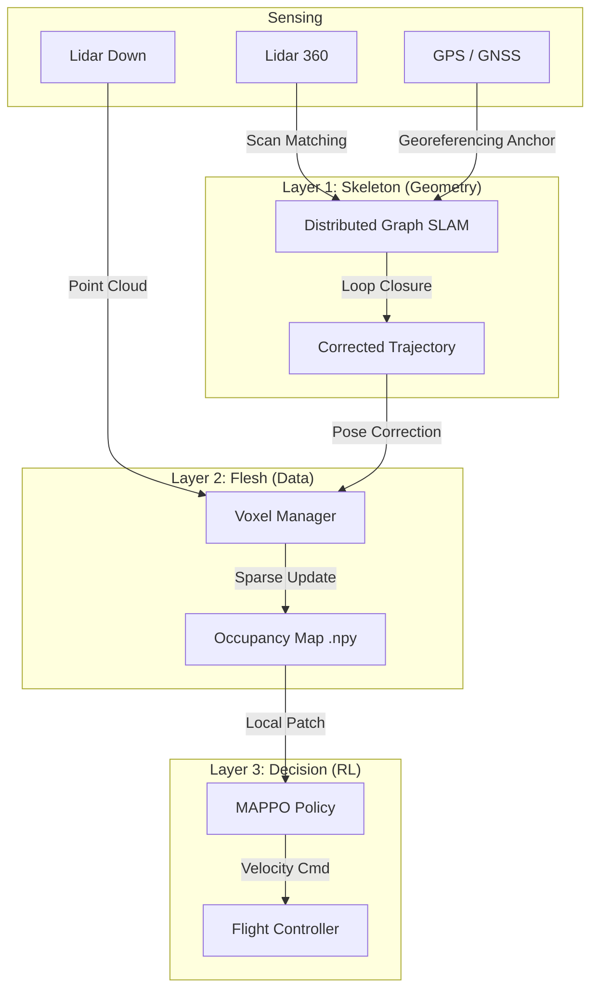

# Research Guide: RL & Architecture Definition 📚

## 1. Mathematical Formulation (Dec-POMDP)

The problem is modeled as a **Decentralized Partially Observable Markov Decision Process** defined by the tuple $\langle \mathcal{I}, \mathcal{S}, \mathcal{A}, \mathcal{O}, \Omega, \mathcal{T}, \mathcal{R}, \gamma \rangle$.

### A. State & Observation Space
*   **Global State ($s_t \in \mathcal{S}$)**: The true occupancy grid $M_{global}$ and poses of all agents.
*   **Observation ($o_t^i \in \Omega$)**:
    *   **Lidar Scan**: $L_t^i \in \mathbb{R}^{16}$ (Downsampled 360° scan).
    *   **Local Map**: $M_{local}^i \in \{0, 1\}^{7 \times 7 \times 5}$ (Voxel patch around agent).
    *   **kinematics**: $[x, y, z, v_x, v_y, v_z, battery, storage]$.
    *   **Neighbors**: Relative positions of nearby agents within communication range $R_{com}$.

### B. Action Space ($\mathcal{A}$)
Continuous velocity control for each agent $i$:
$$a_t^i = [v_x, v_y, v_z, \omega_z] \in [-1, 1]^4$$

### C. Reward Function ($\mathcal{R}$)
The collective goal is to maximize the global map coverage entropy while maintaining energy efficiency.

$$R_{total}^i = w_c \cdot R_{cov} + w_s \cdot R_{store} + w_e \cdot R_{energy} + P_{col} + P_{rtb}$$

1.  **Exploration ($R_{cov}$)**:
    $$R_{cov} = \sum_{v \in \Delta V_t} \mathbb{I}(v \text{ is new})$$
    Gain based on *new* voxels discovered in the global map.

2.  **Data Offloading ($R_{store}$)**:
    $$R_{store} = \begin{cases} \alpha + \beta \cdot |B_t^i| & \text{if } d(p_t^i, P_{station}) < \delta \\ 0 & \text{otherwise} \end{cases}$$
    Large sparse reward for successfully uploading the data buffer $B_t^i$ to the base station.

3.  **Return-to-Base Pressure ($P_{rtb}$)**:
    Active when $Battery < 30\%$ or $Storage > 80\%$.
    $$P_{rtb} = - \lambda \cdot \| p_t^i - P_{station} \|$$
    Provides a gradient pushing the agent towards the station.

4.  **Stability & Ground Safety ($R_{stab} + R_{ground}$)**:
    *   **Stability**: $R_{stab} = -0.5 \cdot (|Roll| + |Pitch|)$. Encourages flat flight.
    *   **Ground Safety**: If $z < 0.3m$ and tilt $> 0.26$ rad ($\approx 15^\circ$), huge penalty $(-5.0)$ to prevent crashing on landing.

## 2. System Architecture

### Hybrid Mapping Pipeline

We employ a parallel architecture to robustly solve the limitations of pure RL mapping.



### Data Flow
1.  **Lidar 360** provides geometric constraints (SLAM) to fix drift.
2.  **Lidar Down** provides coverage data (Occupancy) which is projected using the SLAM-corrected pose.
3.  **GPS** anchors the SLAM graph to real-world coordinates.

## 3. Training Configuration (Hyperparameters)

Located in `src/scripts/train_skrl.py` and `swarm_coverage_env.py`.

### A. "The Playground" (Tuning) 🎛️

| Parameter | Symbol | Current Value | Description |
| :--- | :--- | :--- | :--- |
| **Max Storage** | $C_{max}$ | `500` Voxels | Capacity of drone's data buffer. |
| **Collision Penalty** | $P_{col}$ | `-100.0` | Penalty for wall impact. |
| **Storage Reward** | $w_s$ | `2.0` | Base reward for offloading data. |
| **Energy Cost** | $w_e$ | `-0.1` | Cost per meter traveled. |
| **Stability Penalty** | $w_{stab}$ | `-0.5` | Penalty scale for tilt (Roll/Pitch). |
| **Ground Crash** | $P_{crash}$ | `-5.0` | Penalty for unsafe landing/tipping. |
| **Learning Rate** | $\alpha$ | `3e-4` | Optimizer step size (PPO). |
| **Gamma** | $\gamma$ | `0.99` | Discount factor. |

## 4. Running Experiments 🚀

To start a full experiment, follow this sequence:

### Step 1: Generate the Environment (Optional)
If you want a fresh city layout:
```bash
# Generates 'generated_city.sdf' in assets/worlds/
python3 src/swarm_sim_pkg/swarm_sim/assets/worlds/generate_city.py --mode full --max_height 8
```

### Step 2: Launch the Simulation
This brings up Gazebo, RViz, and spawns the 3 drones and ground station.
*Note: The auto-launcher handles the world loading.*
```bash
ros2 launch swarm_sim super_simulation.launch.py
```
*Wait until you see the drones on the ground in Gazebo.*

### Step 3: Run Swarm SLAM (MRG)
In a separate terminal, launch the distributed Graph SLAM system (one node per drone):
```bash
ros2 launch swarm_sim swarm_slam.launch.py
```
*   **Verification**: This enables "Global Map" saving (with GPS constraints) and loop closure.
*   **topics**: `/uav_*/mrg_slam/map`, `/uav_*/mrg_slam/graph`
*   **Real-time Viz**:
    *   **Occupancy (Global)**: Add `PointCloud2`, Topic `/coverage_map_voxels`.
    *   **Markers (Cones/Stations)**: Add `MarkerArray`, Topic `/comm_range_markers`.

### Note on Map Formats
The environment now saves maps in **.npy** (Raw Indices), **.laz** (Compressed Lidar), and **.ply** (Mesh/Point Viz).
*   **Best for Visualization**: `.laz` (use CloudCompare/QGIS) or `.ply` (MeshLab).
*   **Best for Python**: `.npy` (use `visualize_occupancy.py`).

### Step 4: Start RL Training
Launch the centralized training script (Multi-Agent PPO).
```bash
cd src/swarm_sim_pkg/swarm_sim/training
python3 train_swarm.py
```
*   **Outputs**: Check `src/swarm_sim_pkg/swarm_sim/logs/` for Tensorboard data.
*   **Model**: Saved to `src/swarm_sim_pkg/swarm_sim/models/ppo_swarm_coverage.zip` upon completion.
*   **Visualization**: Open RViz and check `/coverage_map_voxels` to see the agents learning to explore.

### Step 5: Evaluation & Map Generation
To test the trained policy and generate the final Associative Map:
```bash
cd src/swarm_sim_pkg/swarm_sim/evaluation
python3 evaluate_swarm.py
```
*   **Result**: The final occupancy map (what the station "knows") is saved to:
    `src/swarm_sim_pkg/swarm_sim/outputs/eval_associative_map.npy`

---
### 📂 Data & Output
*   **`outputs/`**: Contains `.npy` files of the maps generated by the station.
    *   *Note: If running in Docker with the workspace mounted (e.g., standard DevContainer), these files are directly accessible in `src/swarm_sim_pkg/swarm_sim/outputs/` on your host machine.*
*   **`logs/`**: Tensorboard logs for training curves.

## 5. Configuration Reference ⚙️

### A. City Generator (`generate_city.py`)
Customize the environment generation with these arguments:

| Argument | Description | Default |
| :--- | :--- | :--- |
| `--mode` | Density of buildings (`full`, `medium`, `low`) | `medium` |
| `--width` | Total width of the city area (meters) | `100` |
| `--length` | Total length of the city area (meters) | `100` |
| `--max_height` | Maximum height of buildings | `15` |
| `--num_blocks` | Number of buildings (approx) | `20` |
| `--safe_zone` | Radius around (0,0) cleared of obstacles | `5.0` |

**Example**:
```bash
python3 .../generate_city.py --mode full --width 150 --max_height 25 --safe_zone 8
```

### B. Ground Stations
Currently, the simulation spawns **2 Ground Stations** at fixed locations:
1.  **Station 1**: `(x=5.0, y=5.0)`
2.  **Station 2**: `(x=-5.0, y=-5.0)`

*To modify station locations or count, edit:* `src/swarm_sim_pkg/launch/spawn_stations.launch.py`

