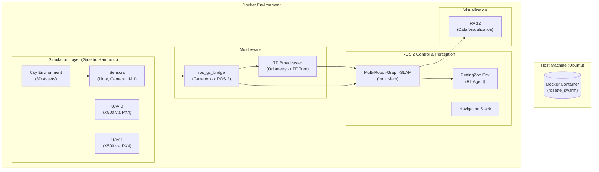
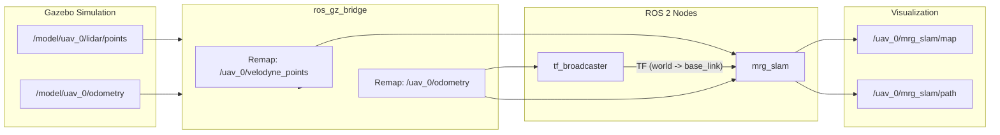

# Multi-UAV Swarm Simulation & SLAM Architecture

## 1. System Overview
This project implements a high-fidelity simulation environment for Multi-Agent Reinforcement Learning (MARL) and Cooperative SLAM using UAVs. The system is containerized using Docker to ensure reproducibility and utilizes **ROS 2 Jazzy** and **Gazebo Harmonic**.

### Architecture Diagram

---

## 2. UAV & Sensor Configuration
The simulation uses a customized **X500** quadrotor frame. Each UAV is equipped with a comprehensive sensor suite designed for autonomous navigation and mapping.

### Sensor Suite
| Sensor | Model | Topic (ROS 2) | Frequency | Description |
| :--- | :--- | :--- | :--- | :--- |
| **3D Lidar** | Velodyne VLP-16 (Simulated) | `/{name}/velodyne_points` | 10 Hz | 360° spinning Lidar, 16 channels, 100m range. Used for mapping and obstacle avoidance. |
| **Front Camera** | RGB Camera | `/{name}/camera/image_raw` | 30 Hz | Forward-facing camera for visual perception. |
| **Down Camera** | RGB Camera | `/{name}/down_camera/image_raw` | 30 Hz | Downward-facing camera for landing and ground target tracking. |
| **IMU** | 6-DOF IMU | `/{name}/sensors/imu` | 100 Hz | Accelerometer and Gyroscope for state estimation. |

### Lidar Simulation Report
The simulating Lidar mimics a **Velodyne VLP-16** Puck.
- **Mechanism**: A physical spinning link (`lidar_spin_link`) rotates in Gazebo, sweeping a ray sensor across the environment.
- **Data Output**: Generates a `PointCloud2` message containing X, Y, Z coordinates and intensity data.
- **Visual**: In RViz, this appears as a dense cloud of points outlining buildings and obstacles, updating in real-time as the drone moves.

---

## 3. Data Flow & Topics
The following diagram illustrates how sensor data flows from the simulation to the SLAM algorithm and visualization.

### Topic Graph

---

## 4. Coordinate Frames (TF Tree)
A complete path of transforms (TF) is strictly maintained to ensure data validity.

**Tree Structure:**
`world` (Global Frame)
  └── `uav_0/base_link` (Robot Body)
      ├── `uav_0/lidar_link` (Mount)
      │   └── `uav_0/lidar_spin_link` (Spinner)
      │       └── `uav_0/lidar_spin_link/lidar_3d` (Sensor Optical Center)
      ├── `uav_0/camera_link` (Front Camera)
      └── `uav_0/imu_link` (IMU)

**Key Modules:**
1.  **tf_broadcaster**: A custom Python node that subscribes to Gazebo odometry and broadcasts the dynamic `world -> base_link` transform.
2.  **robot_state_publisher**: Publishes the static transforms (links relative to base_link) based on the URDF description.

---

## 5. Software Interfaces
- **Multi-Robot-Graph-SLAM (mrg_slam)**: A graph-based SLAM approach that fuses Lidar and Odometry. It supports multi-robot map merging by exchanging graph descriptors between agents.
- **PettingZoo Interface**: A Python-based Gym environment (`swarm_coverage_env.py`) that consumes processed map data and controls the drones for RL training.
