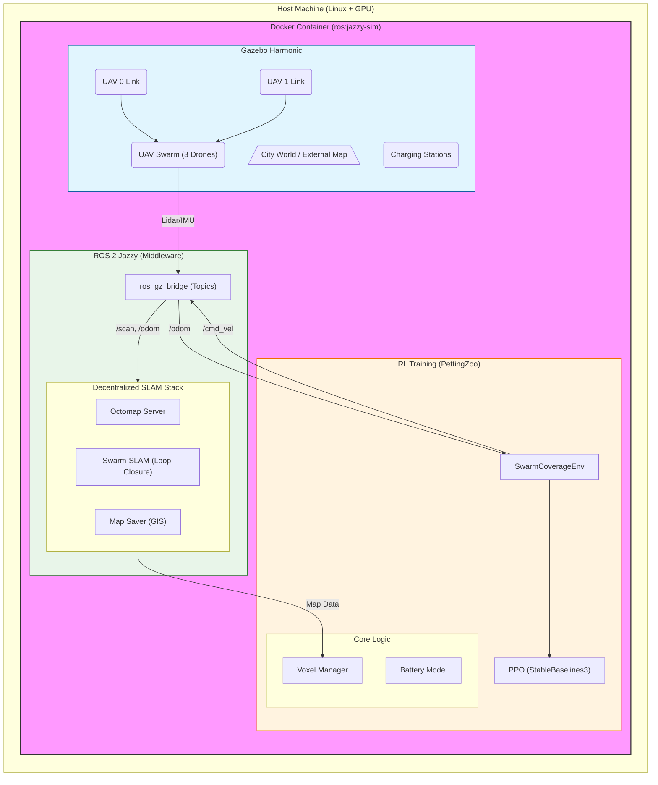

# System Architecture

## System Modules
1.  **Simulation**: Handles Physics, Sensor generation (Raycasting), and Battery drain visuals.
2.  **ROS 2 Bridge**: Translates Jazzy messages to Gazebo protobufs.
3.  **SLAM Layer**:
    -   **Octomap**: Generates the volumetric occupancy map (`.bt`).
    -   **Swarm-SLAM**: (In Progress) Handles decentralized loop closure detection.
4.  **Learning Environment**:
    -   **SwarmCoverageEnv**: PettingZoo interface.
    -   **VoxelManager**: Efficiently tracks visited voxels and handles "Merging" when agents meet.
